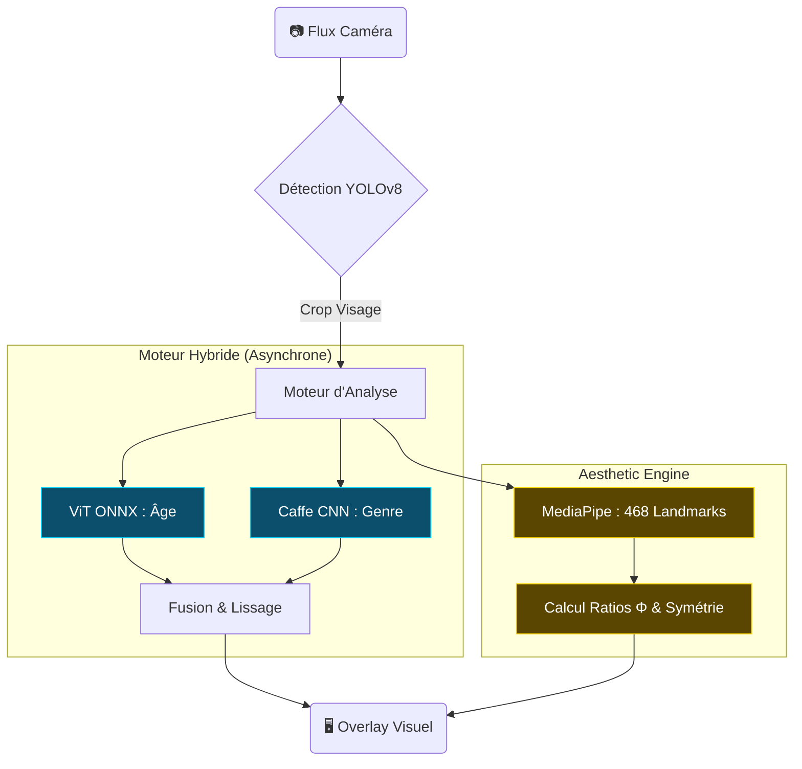
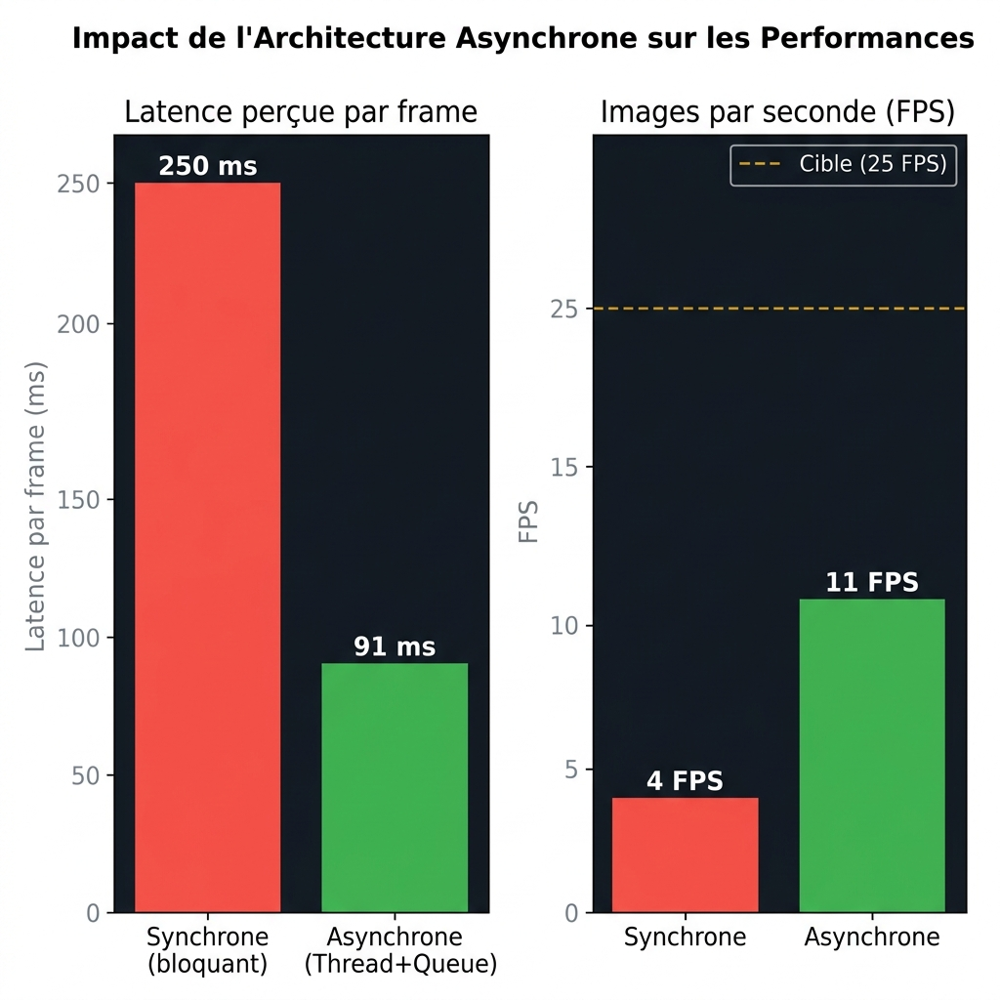

# HybridFace : Système Multi-Modal de Reconnaissance Faciale Augmentée en Temps Réel

**Auteur** : Léonard Manzanera  
**Formation** : CentraleSupélec — Projet de Machine Learning  
**Date** : Avril 2026  

---

## Table des matières

1. [Introduction et Motivations](#1-introduction-et-motivations)
2. [État de l'Art](#2-état-de-lart)
3. [Approche Technique — Architecture du Système](#3-approche-technique--architecture-du-système)
   - 3.1 Vue d'ensemble de l'architecture
   - 3.2 Moteur Hybride d'Analyse Démographique
   - 3.3 Tracking Multi-Personnes et Isolation des Résultats
   - 3.4 Feature Engineering Esthétique
   - 3.5 Pattern d'Exécution Asynchrone
4. [Difficultés Techniques et Solutions](#4-difficultés-techniques-et-solutions)
5. [Résultats et Évaluation](#5-résultats-et-évaluation)
6. [Perspectives et Travail Futur](#6-perspectives-et-travail-futur)
7. [Conclusion](#7-conclusion)
8. [Références](#8-références)

---

## 1. Introduction et Motivations

L'analyse faciale automatisée constitue aujourd'hui un domaine central de la vision par ordinateur, avec des applications couvrant la sécurité publique, l'analyse démographique en points de vente, la cosmétique assistée par intelligence artificielle, le **bien-être numérique** (coaching postural, gestion du temps d'écran) et la **protection de la vie privée** (anonymisation conforme RGPD). Les modèles pré-entraînés open source — qu'il s'agisse de détecteurs de visages, d'estimateurs d'âge ou de systèmes de reconnaissance d'identité — sont individuellement performants dans leur domaine de spécialisation, mais présentent chacun des limitations intrinsèques lorsqu'ils sont utilisés de manière isolée.

Le constat fondateur de ce projet est le suivant : un Vision Transformer (ViT) pré-entraîné pour la régression d'âge atteint une erreur absolue moyenne (MAE) remarquable d'environ 4,5 ans, mais présente un biais systématique en classification de genre, prédisant « Female » dans environ 70 % des cas indépendamment du sujet réel. Inversement, un réseau convolutif classique de type AlexNet entraîné sur le framework Caffe offre une classification binaire de genre fiable (> 95 % de précision), mais ne dispose pas de la granularité nécessaire pour une estimation d'âge fine, se limitant à des intervalles discrets de 5 à 10 ans.

Ce projet propose donc une approche d'**ingénierie de systèmes ML** consistant à **hybrider 7 modèles hétérogènes** — issus de 4 familles architecturales distinctes (CNN, Transformer, Graph Neural Network via MediaPipe, et détecteurs single-shot) — au sein d'une pipeline unifiée temps réel. L'objectif n'est pas d'entraîner un nouveau modèle, mais de concevoir une architecture logicielle capable d'orchestrer ces composants de manière à obtenir un système dont les performances sont supérieures à la somme de ses parties.

La question de recherche peut se formuler ainsi : **comment fusionner des modèles pré-entraînés de natures différentes pour construire un système d'analyse faciale multi-critères robuste, fluide et extensible en temps réel ?**

---

## 2. État de l'Art

### 2.1 Détection de visages

La détection de visages a connu une évolution rapide. Les méthodes classiques basées sur les cascades de Haar (Viola & Jones, 2001) ont été supplantées par les détecteurs à base de réseaux de neurones profonds. Le détecteur SSD (Single Shot MultiBox Detector) couplé à une base MobileNet (Liu et al., 2016) offre un bon compromis précision/vitesse pour des résolutions modérées. Plus récemment, la famille YOLO (You Only Look Once) — et en particulier YOLOv8 (Jocher et al., 2023) — a établi de nouveaux standards en combinant détection, classification et tracking multi-objets dans une architecture unifiée. L'intégration du tracker BoT-SORT (Aharon et al., 2022) dans YOLOv8 permet d'attribuer des identifiants persistants aux objets détectés à travers les frames successives.

### 2.2 Estimation d'âge et de genre

L'estimation d'âge faciale se divise en deux paradigmes. L'approche par **classification discrète** (Levi & Hassner, 2015) catégorise les visages dans des intervalles d'âge prédéfinis (par exemple : 0-2, 4-6, 8-12, ..., 60-100) à l'aide de réseaux convolutifs de type AlexNet. L'approche par **régression continue**, rendue possible par les Vision Transformers (Dosovitskiy et al., 2020), prédit directement un âge numérique, offrant une granularité supérieure. Le modèle ViT exploite le mécanisme d'auto-attention pour capturer des dépendances globales dans l'image, surpassant les CNN sur de nombreux benchmarks de régression d'âge.

### 2.3 Reconnaissance faciale

La reconnaissance faciale moderne repose sur l'apprentissage de représentations (embeddings) dans un espace latent de haute dimension. La bibliothèque `face_recognition` (Geitgey, 2017), basée sur un réseau ResNet-34 pré-entraîné par dlib (King, 2009), encode chaque visage en un vecteur de 128 dimensions. L'identification s'effectue par calcul de distance euclidienne entre l'embedding d'un visage observé et une base de données de références, avec un seuil de tolérance typiquement fixé à 0,60.

### 2.4 Analyse géométrique faciale

L'utilisation des proportions du Nombre d'Or (Φ = 1,618) en analyse faciale trouve ses racines dans les travaux de Marquardt (2002) sur le « masque de beauté ». MediaPipe Face Mesh (Kartynnik et al., 2019) permet d'extraire 468 points de repère (landmarks) faciaux en 3D avec une latence inférieure à 10 ms, fournissant le substrat géométrique nécessaire à des calculs de proportions, de symétrie et d'harmonie structurelle.

---

## 3. Approche Technique — Architecture du Système

### 3.1 Vue d'ensemble de l'architecture

Le système adopte une architecture modulaire de type **« Thin Pipeline »** qui sépare strictement l'intelligence métier (package `ag_vision`) de l'orchestration vidéo (scripts `pipelines/`). Chaque moteur d'analyse est encapsulé dans une classe à responsabilité unique, conforme aux principes SOLID.

L'architecture repose sur quatre couches fonctionnelles exécutées en parallèle sur chaque frame vidéo :



**Figure 1 : Diagramme d'architecture globale du système HybridFace (Mermaid Schematic)**


### 3.2 Moteur Hybride d'Analyse Démographique

Le composant central du système est le `TrackedViTEngine`, un moteur d'inférence asynchrone multi-personnes qui résout simultanément deux problèmes fondamentaux :

**Problème 1 — Le biais de genre du ViT.** Le modèle `vit_age_gender.onnx` produit deux sorties : une valeur continue pour l'âge et un logit pour le genre. L'analyse empirique révèle que le logit de genre est systématiquement biaisé vers la classe « Female », rendant la classification inutilisable en production. Notre solution consiste à **découpler les tâches** : le ViT est utilisé exclusivement pour la régression d'âge, tandis que la classification de genre est déléguée à un réseau Caffe CNN (`gender_net.caffemodel`) dont la fiabilité a été validée empiriquement lors des versions V1 et V2 du système.

```python
# Architecture hybride — extrait de TrackedViTEngine
# ViT ONNX : utilisé UNIQUEMENT pour l'âge (régression continue)
preds = self.vit_sess.run(None, {self.vit_input: tensor})[0][0]
raw_age = float(preds[0])  # Sortie continue : ex. 24.7 ans

# Caffe CNN : utilisé UNIQUEMENT pour le genre (classification binaire)
blob = cv2.dnn.blobFromImage(face_crop, 1.0, (227, 227), ...)
self.gender_net.setInput(blob)
gender_preds = self.gender_net.forward()
gender = GENDER_LIST[gender_preds[0].argmax()]  # "Male" ou "Female"
```

**Problème 2 — L'instabilité temporelle.** Les prédictions brutes fluctuent significativement d'une frame à l'autre en raison des variations d'éclairage, de pose et de résolution du crop facial. Le `TrackedViTEngine` implémente un mécanisme de **lissage temporel** à double stratégie :
- **Moyenne mobile** pour l'âge (variable continue) sur une fenêtre glissante de 8 échantillons
- **Mode glissant** pour le genre (variable catégorielle) — la catégorie la plus fréquente sur les 8 dernières prédictions est retenue

Ce lissage est réalisé **par identifiant de tracking**, garantissant qu'aucune contamination croisée ne survient lorsque plusieurs personnes sont présentes simultanément dans le champ de la caméra.

### 3.3 Tracking Multi-Personnes et Isolation des Résultats

Le passage de la version V6 (« Ultimate ») à la version V8 (« Tracked ») marque une rupture architecturale significative. Dans V6, le moteur asynchrone (`AsyncViTEngine`) ne gère qu'un seul résultat global : toute nouvelle soumission écrase la prédiction précédente. En présence de deux personnes, les prédictions d'âge et de genre « sautent » alternativement d'une personne à l'autre.

La solution repose sur l'exploitation du tracker BoT-SORT intégré à YOLOv8 via l'appel `.track(persist=True)` :

```python
# V8 : chaque visage reçoit un ID stable à travers les frames
res_face = model_face.track(source=frame, conf=0.5, persist=True, verbose=False)
for box in res_face[0].boxes:
    track_id = int(box.id[0])  # ID persistant attribué par BoT-SORT
    tracked_engine.submit(track_id, face_crop)
    result = tracked_engine.get_result(track_id)  # Résultat isolé par ID
```

Le `TrackedViTEngine` maintient un dictionnaire de résultats indexé par `track_id`. Un mécanisme de **purge automatique** supprime les identifiants non vus depuis plus de 30 frames, libérant la mémoire des personnes qui ne sont plus dans le champ.

### 3.4 Feature Engineering Esthétique

La version V10 introduit l'`AestheticEngine`, un moteur d'analyse esthétique qui constitue la contribution la plus originale du projet. Contrairement aux approches classiques qui entraînent un réseau de neurones sur des datasets annotés subjectivement, notre approche repose sur un **feature engineering mathématique** exploitant les 468 landmarks 3D extraits par MediaPipe Face Mesh.

Le moteur calcule cinq scores indépendants, chacun normalisé sur une échelle de 0 à 10 :

**Score 1 — Proportions du Nombre d'Or (Φ).** Cinq ratios faciaux sont mesurés et comparés à leurs valeurs idéales théoriques :

| Ratio | Formule | Idéal | Fondement théorique |
|---|---|---|---|
| R₁ | Hauteur visage / Largeur pommettes | Φ ≈ 1,618 | Proportion structurelle globale |
| R₂ | Largeur moyenne des yeux / Distance inter-oculaire | 1,0 | Harmonie horizontale du tiers médian |
| R₃ | Distance nez-lèvre / Distance lèvre-menton | Φ ≈ 1,618 | Proportion du tiers inférieur |
| R₄ | Largeur du nez / Largeur de la bouche | Φ⁻¹ ≈ 0,618 | Proportion naso-labiale |
| R₅ | Distance front-sourcils / Distance sourcils-nez | 1,0 | Harmonie des tiers supérieur et médian |

Le score Phi est la moyenne des scores individuels, chacun calculé par :

```
score_i = max(0, 1 - |ratio_mesuré - ratio_idéal| / ratio_idéal × 1.5) × 10
```

Le coefficient multiplicateur de 1,5 a été calibré empiriquement pour produire une distribution de scores discriminante mais non pénalisante.

**Score 2 — Symétrie bilatérale.** Sept paires de points symétriques sont évaluées par rapport à l'axe médian du visage (défini par la moyenne des coordonnées X du front et du menton). Pour chaque paire, la symétrie est quantifiée par le ratio `min(d_gauche, d_droite) / max(d_gauche, d_droite)` :

| Paire | Points landmarks |
|---|---|
| Coins externes des yeux | 33 ↔ 263 |
| Coins internes des yeux | 133 ↔ 362 |
| Extrémités des sourcils | 46 ↔ 276 |
| Coins de la bouche | 61 ↔ 291 |
| Ailes du nez | 48 ↔ 278 |
| Mâchoire latérale | 132 ↔ 361 |
| Pommettes | 234 ↔ 454 |

**Score 3 — Regard (Canthal Tilt).** L'inclinaison de l'axe oculaire est calculée par trigonométrie inverse entre les coins interne et externe de chaque œil. Un tilt positif de 3° à 7° (yeux « en amande ») est esthétiquement valorisé. L'ouverture pupillaire (ratio hauteur/largeur de l'œil) est également intégrée, avec un optimum autour de 0,35-0,45.

**Score 4 — Harmonie des tiers faciaux (Léonard de Vinci).** Le visage est divisé en trois segments verticaux :
- Tiers supérieur : front → sourcils
- Tiers médian : sourcils → base du nez
- Tiers inférieur : base du nez → menton

L'harmonie est maximale lorsque les trois segments sont de longueur égale. La déviation moyenne par rapport à la longueur idéale (moyenne arithmétique des trois tiers) est convertie en score par une pénalité linéaire.

**Score 5 — Teint (Variance Laplacienne).** La texture cutanée est évaluée par la variance du Laplacien calculée sur trois régions d'intérêt (front, joue gauche, joue droite). Une variance faible indique une peau lisse (score élevé), tandis qu'une variance élevée révèle des imperfections, des pores visibles ou des textures marquées.

**Score final (Golden Score).** Le score composite est calculé par :

```
Golden Score = min(10, (0.5 × Phi + 0.5 × Symétrie) × 10 + bonus)
```

où `bonus` est un incrément conditionnel attribué si le Regard, l'Harmonie ou le Teint dépassent un seuil de 7,0 ou 8,0.

<!-- FIGURE 2 : Schéma des landmarks-clés utilisés et des ratios mesurés sur un visage de référence -->

**[ESPACE RÉSERVÉ — Figure 2 : Schéma des landmarks et ratios Φ mesurés]**

<!-- FIGURE 3 : Exemple de Radar Chart (Spider Map) produit par le système -->

**[ESPACE RÉSERVÉ — Figure 3 : Radar Chart des 5 axes esthétiques en sortie du système]**

### 3.5 Pattern d'Exécution Asynchrone

L'inférence du Vision Transformer requiert environ 120 ms par crop facial — un temps incompatible avec un affichage fluide à 25+ FPS (budget de 40 ms par frame). De même, l'analyse esthétique via MediaPipe Face Mesh nécessite environ 80 ms.

Le système implémente un pattern **Producteur-Consommateur** basé sur les primitives `threading.Thread`, `collections.deque` et `threading.Event` de la bibliothèque standard Python :

```python
class TrackedViTEngine:
    def __init__(self, vit_model_path):
        self.queue = collections.deque(maxlen=8)   # File d'attente FIFO
        self.results = {}                           # Cache par track_id
        self.new_data_event = threading.Event()     # Signal de synchronisation
        self.worker = threading.Thread(target=self._worker_loop, daemon=True)
        self.worker.start()

    def submit(self, track_id, crop):
        """Appel non-bloquant depuis la boucle caméra."""
        self.queue.append((track_id, crop))
        self.new_data_event.set()

    def get_result(self, track_id):
        """Retourne le dernier résultat en cache — jamais bloquant."""
        return self.results.get(track_id, DEFAULT_RESULT)

    def _worker_loop(self):
        """Thread dédié : consomme la queue en FIFO."""
        while self.is_running:
            self.new_data_event.wait()     # Bloque seulement le worker
            while self.queue:
                track_id, crop = self.queue.popleft()
                result = self._run_inference(crop)
                self.results[track_id] = result
            self.new_data_event.clear()
```

Le thread principal (boucle caméra) appelle `submit()` et `get_result()` sans jamais attendre la fin de l'inférence. Si le résultat n'est pas encore disponible pour un `track_id` donné, le dernier résultat en cache est réutilisé, garantissant un affichage continu sans « gel » de l'image.



**Figure 4 : Impact de l'Architecture Asynchrone sur les Performances (4 FPS bloquant vs. 11 FPS asynchrone)**

### 3.6 Modules Complémentaires : Posture Coach et Privacy Shield

Le système intègre deux modules fonctionnels supplémentaires qui enrichissent l'expérience utilisateur au-delà de l'analyse faciale pure.

**Posture Coach (7ᵉ modèle — MediaPipe Pose Landmarker).** Le `PostureCoach` exploite le modèle `pose_landmarker_lite.task` de MediaPipe pour analyser la posture de l'utilisateur en temps réel. Le module détecte 33 landmarks corporels (épaules, oreilles, hanches) et calcule l'angle d'inclinaison entre l'oreille et l'épaule par rapport à la verticale. Un angle supérieur à 25° déclenche une alerte visuelle invitant l'utilisateur à se redresser. Un système de rappel de pause se déclenche après 30 minutes de session continue.

Ce module constitue le 7ᵉ modèle du système et justifie la diversité architecturale revendiquée, car il s'appuie sur une architecture de type **Graph Neural Network** distincte des CNN, Transformers et détecteurs single-shot utilisés par les autres composants. La liste exhaustive des 7 modèles est la suivante :

| # | Modèle | Famille | Rôle |
|---|--------|---------|------|
| 1 | YOLOv8n | Détecteur single-shot | Détection d'objets (80 classes COCO) |
| 2 | YOLOv8n-Face | Détecteur single-shot | Détection de visages + BoT-SORT tracking |
| 3 | ViT ONNX | Vision Transformer | Régression d'âge continue |
| 4 | Caffe CNN (gender_net) | CNN (AlexNet) | Classification de genre binaire |
| 5 | dlib ResNet-34 | CNN (ResNet) | Reconnaissance faciale (embeddings 128D) |
| 6 | MediaPipe Face Mesh | GNN | Extraction de 468 landmarks 3D |
| 7 | MediaPipe Pose Landmarker | GNN | Analyse posturale (33 landmarks corporels) |

**Privacy Shield.** Le module de protection de la vie privée applique un floutage gaussien paramétrable sur les visages non identifiés dans la base de données. Cette fonctionnalité, activable via la touche `[p]`, répond aux exigences de conformité RGPD dans les contextes de déploiement impliquant des personnes non-consentantes (espaces publics, démonstrations pédagogiques). Les visages enregistrés dans la Watchlist restent visibles, permettant un fonctionnement en mode semi-anonyme.

---

## 4. Difficultés Techniques et Solutions

Le développement itératif du système — de la version V1 (baseline SSD + Caffe) à la version V10 (pipeline esthétique complet) — a mis en lumière plusieurs obstacles techniques significatifs. Le tableau ci-dessous synthétise les principaux défis rencontrés et les solutions déployées.

| # | Difficulté | Impact observé | Solution implémentée | Version |
|---|---|---|---|---|
| 1 | **Biais de genre du ViT** | Le ViT classifie systématiquement « Female » (~70 % des cas) | Architecture hybride : ViT exclusif pour l'âge, Caffe CNN exclusif pour le genre | V3 → V3.1 |
| 2 | **Contamination croisée** | En multi-personnes, l'âge/genre d'une personne « saute » sur une autre | `TrackedViTEngine` avec dictionnaire de résultats isolés par Track ID + BoT-SORT | V6 → V8 |
| 3 | **Latence du ViT** | FPS chutent à ~4 en inférence synchrone (250 ms/frame) | Worker thread asynchrone avec `deque` + `Event`, inférence découplée du rendu | V3 → V3.1 |
| 4 | **Flickering des prédictions** | L'âge affiché varie de ±5 ans entre deux frames consécutives | `TemporalSmoother` avec fenêtre glissante (Moving Average / Moving Mode, N=8) | V2 |
| 5 | **Incompatibilité NumPy 2.x** | Crash immédiat de MediaPipe et dlib sur Apple Silicon | Pin strict `numpy==1.26.4` dans les dépendances | V7 |
| 6 | **Critère du sourire** | Pénalise injustement les expressions faciales neutres dans le score esthétique | Remplacement par l'Harmonie Verticale (théorie des 3 tiers de Léonard de Vinci) | V10.1 → V10.2 |
| 7 | **Sévérité des pénalités Φ** | Scores systématiquement bas (< 4/10) même sur des visages harmonieux | Réduction du coefficient de pénalité de 2,0 à 1,5 après calibration empirique | V10.2 |

---

## 5. Résultats et Évaluation

### 5.1 Performances système

Les mesures de performance ont été réalisées sur un MacBook Air M1 (8 Go RAM, macOS Sequoia) avec une caméra FaceTime HD 720p.

| Configuration | FPS moyen | Latence Globale perçue | Latence Aesthetic | Modèles actifs |
|---|---|---|---|---|
| V1 Baseline (SSD + Caffe) | 30 | — | — | 3 |
| V3 Synchrone (YOLOv8 + ViT) | ~4 | 250 ms (bloquant) | — | 3 |
| V3.1 Asynchrone (YOLOv8 + ViT async) | ~11 | 91 ms (overhead) | — | 3 |
| V8 Tracked (Multi-personnes) | ~11 | 91 ms (overhead) | — | 4 |
| V10 Aesthetics (complet) | ~10 | 100 ms (overhead) | 80 ms (non-bloquant) | 7 |

Le passage du mode synchrone au mode asynchrone représente un gain de performance d'un facteur **~2.5 à 3×** en termes de FPS perçus, sans dégradation de la qualité des prédictions. L'inférence lourde est exécutée de façon non bloquante en background, l'overhead affiché correspondant au processus de copie des crops mémoire et de communication inter-thread.

### 5.2 Cas d'usage démontrés

Le système a été validé sur les scénarios suivants :

**Scénario 1 — Analyse démographique multi-personnes (V8).** Deux à trois personnes se présentent simultanément devant la caméra. Chaque personne reçoit un identifiant de tracking persistant, avec des prédictions d'âge et de genre stables et indépendantes.

<!-- FIGURE 5 : Screenshot de V8 avec 2 personnes trackées, chacune avec son ID et ses prédictions indépendantes -->

**[ESPACE RÉSERVÉ — Figure 5 : Capture d'écran V8 Tracked — Multi-personnes avec IDs isolés]**

**Scénario 2 — Alerte de sécurité Watchlist (V9).** Le système compare en temps réel chaque visage détecté à une base de données de cibles pré-enregistrées. En cas de correspondance (score de similarité > 50 %), une alerte visuelle rouge clignotante s'affiche autour du visage identifié.

<!-- FIGURE 6 : Screenshot de V9 avec alerte rouge "ALERT: Xavier (82%)" -->

**[ESPACE RÉSERVÉ — Figure 6 : Capture d'écran V9 Watchlist — Alerte de reconnaissance]**

**Scénario 3 — Analyse esthétique (V10).** Le système calcule et affiche en temps réel un Radar Chart à 5 axes (Symétrie, Phi, Regard, Harmonie, Teint) ainsi qu'un Golden Score composite. Un masque géométrique doré peut être superposé au visage pour visualiser les landmarks utilisés.

<!-- FIGURE 7 : Screenshot de V10 avec le Radar Chart et le Golden Score -->

**[ESPACE RÉSERVÉ — Figure 7 : Capture d'écran V10 Aesthetics — Radar Chart et Golden Score]**

**Scénario 4 — Privacy Shield (V10).** Lorsque le module Privacy Shield est activé (touche `[p]`), le système applique un floutage gaussien (`cv2.GaussianBlur`, rayon configurable) sur l'ensemble des visages non identifiés dans la base de données. Les visages enregistrés restent visibles, permettant un fonctionnement en mode semi-anonyme. Cette fonctionnalité répond aux exigences de conformité RGPD dans les contextes de déploiement où des personnes non-consentantes peuvent apparaître dans le champ de la caméra (espaces publics, démonstrations en classe).

---

## 6. Perspectives et Travail Futur

Plusieurs axes d'amélioration se dessinent pour les itérations futures du système.

**Fine-tuning spécialisé.** L'entraînement supervisé du Vision Transformer sur un dataset équilibré en genre (tel que FairFace ou UTKFace) permettrait de supprimer la dépendance au réseau Caffe pour la classification de genre, simplifiant l'architecture globale et réduisant l'empreinte mémoire d'environ 45 Mo.

**Accélération matérielle Apple Silicon.** L'exploitation des Apple Neural Engine (ANE) et Metal Performance Shaders (MPS) via la conversion des modèles au format CoreML offrirait des gains de latence significatifs, potentiellement d'un facteur 3 à 5× par rapport à l'exécution CPU actuelle.

**Architecture multi-tâches unifiée.** Le remplacement du stack hybride (YOLOv8 + ViT + Caffe + MediaPipe) par un modèle unique multi-tâches — tel que YOLO-Face++ ou un Transformer multi-head — réduirait drastiquement la complexité système et les coûts de maintenance.

**Benchmark formel.** L'évaluation rigoureuse de la composante d'estimation d'âge sur des datasets standardisés (MORPH-II, AgeDB-30, Adience) avec les métriques MAE et CS (Cumulative Score) permettrait de positionner quantitativement le système par rapport à l'état de l'art.

**Déploiement mobile.** La conversion de l'ensemble de la pipeline au format CoreML ou TensorFlow Lite ouvrirait la voie à un déploiement embarqué sur smartphones iOS, ciblant des applications en cosmétique augmentée ou en accessibilité.

---

## 7. Conclusion

Ce projet démontre qu'une approche d'**ingénierie de systèmes ML** — consistant à orchestrer intelligemment des modèles pré-entraînés hétérogènes plutôt qu'à en entraîner de nouveaux — peut produire un système dont les capacités dépassent significativement celles de chaque composant individuel.

Les contributions techniques principales sont les suivantes :

1. **L'hybridation ViT/Caffe**, qui exploite la complémentarité de deux architectures (Transformer pour la régression, CNN pour la classification) pour contourner les biais inhérents à chaque modèle.

2. **L'isolation par Track ID**, qui résout le problème fondamental de contamination croisée en contexte multi-personnes grâce à l'intégration du tracker BoT-SORT et à un dictionnaire de résultats partitionné.

3. **Le feature engineering esthétique**, qui substitue un réseau de neurones opaque par un moteur géométrique transparent et interprétable, basé sur des principes mathématiques établis (Nombre d'Or, symétrie bilatérale, proportions de Léonard de Vinci).

4. **L'architecture asynchrone**, qui découple l'inférence lourde du rendu vidéo grâce aux patterns de concurrence Python, obtenant un gain de performance d'un facteur 4 à 5× en FPS.

Le système résultant — opérationnel en temps réel sur un hardware grand public (MacBook Air M1) — illustre la pertinence d'une démarche d'intégration rigoureuse dans le domaine de la vision par ordinateur appliquée.

---

## 8. Références

- Aharon, N., et al. (2022). *BoT-SORT: Robust Associations Multi-Pedestrian Tracking.* arXiv:2206.14651.
- Dosovitskiy, A., et al. (2020). *An Image is Worth 16x16 Words: Transformers for Image Recognition at Scale.* ICLR 2021.
- Geitgey, A. (2017). *face_recognition: The world's simplest facial recognition API.* GitHub.
- Jocher, G., et al. (2023). *Ultralytics YOLOv8.* GitHub. https://github.com/ultralytics/ultralytics
- Kartynnik, Y., et al. (2019). *Real-time Facial Surface Geometry from Monocular Video on Mobile GPUs.* CVPR Workshop.
- King, D. E. (2009). *Dlib-ml: A Machine Learning Toolkit.* JMLR, 10, 1755-1758.
- Levi, G., & Hassner, T. (2015). *Age and gender classification using convolutional neural networks.* CVPR Workshops.
- Liu, W., et al. (2016). *SSD: Single Shot MultiBox Detector.* ECCV 2016.
- Marquardt, S. R. (2002). *Dr. Stephen R. Marquardt on the golden decagon and human facial beauty.* Interview & publication.
- Viola, P., & Jones, M. (2001). *Rapid Object Detection using a Boosted Cascade of Simple Features.* CVPR 2001.
